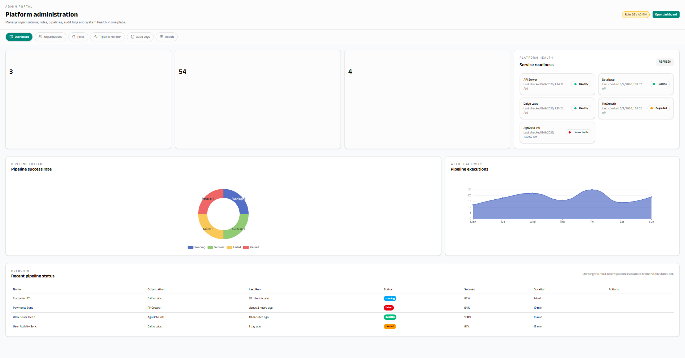
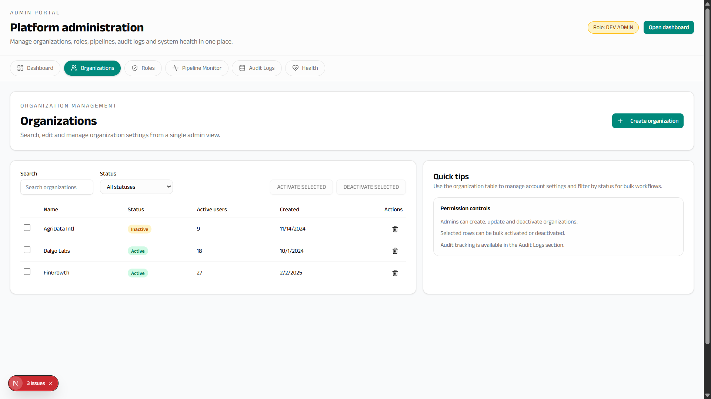
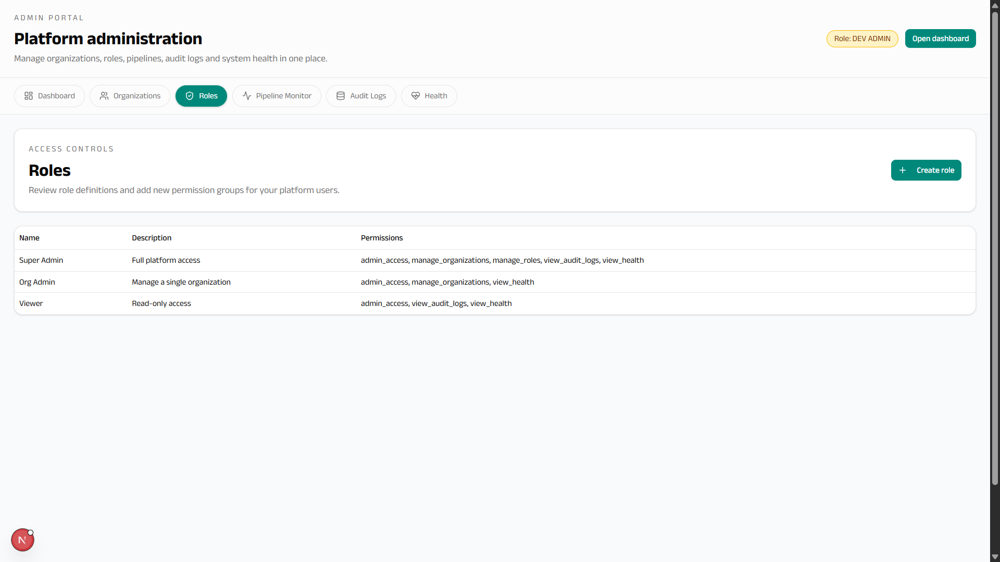
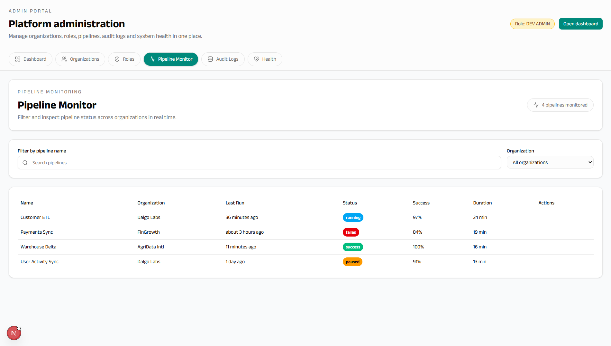
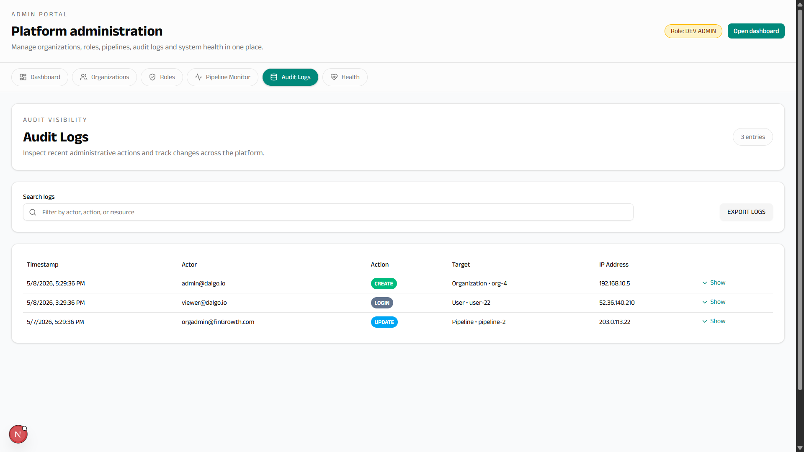
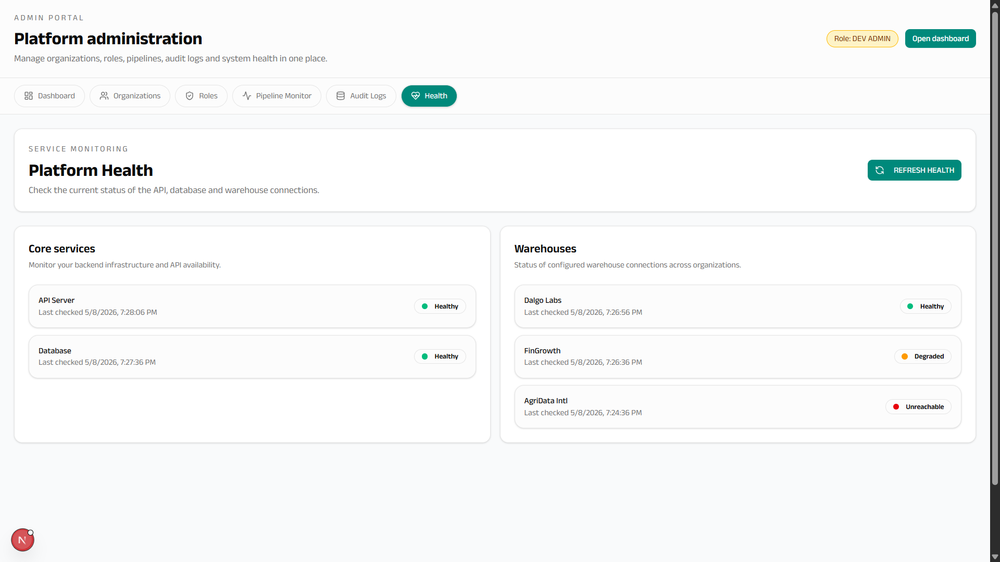

# Dalgo Admin Portal — Frontend Proposal (C4GT 2026)

## Overview

This proposal implements the complete frontend for the Dalgo Admin Portal — a centralized management interface for platform administrators to manage organizations, users, roles, warehouse health, and platform observability. The implementation is built as a modern Next.js 15 React 19 web application, providing a comprehensive dashboard system with data visualization, analytics, and reporting capabilitices.

The frontend delivers an intuitive, responsive interface that integrates seamlessly with the backend APIs, featuring advanced data visualization, real-time monitoring, and comprehensive admin controls.

---

## 1. Directory Structure
```
webapp_v2/
├── app/                      # Next.js App Router pages
│   ├── admin/               # Admin portal pages
│   │   ├── organizations/   # Org management
│   │   ├── roles/          # Role management
│   │   ├── invitations/    # Invitation system
│   │   ├── health/         # Monitoring dashboard
│   │   └── audit-logs/     # Activity logs
│   ├── charts/             # Chart management
│   ├── dashboards/         # Dashboard CRUD
│   └── [other features]
├── components/
│   ├── ui/                 # Reusable UI components
│   ├── admin/              # Admin-specific components
│   │   ├── org-table.tsx
│   │   ├── role-form.tsx
│   │   ├── health-dashboard.tsx
│   │   └── audit-log-viewer.tsx
│   └── [feature components]
├── hooks/
│   ├── api/                # SWR-based API hooks
│   │   ├── useOrganizations.ts
│   │   ├── useRoles.ts
│   │   └── useHealth.ts
│   └── [custom hooks]
├── stores/                 # Zustand stores
│   └── authStore.ts
├── lib/                    # Global utilities
│   ├── api.ts             # API client
│   ├── toast.ts           # Notifications
│   └── utils.ts
└── types/                  # TypeScript interfaces
    └── admin.ts
```

---

## 2. Core Features Implemented

### Organization Management
- **List View**: Paginated table with search and filtering
- **Create/Edit**: Modal forms for organization CRUD operations
- **Bulk Actions**: Activate/deactivate multiple organizations
- **Details View**: Comprehensive org information with warehouse status

### Role & Permission Management
- **Role Listing**: Display all available roles with permissions
- **Role Creation**: Form-based role creation with permission assignment
- **Role Updates**: Inline editing and bulk permission management
- **Permission Matrix**: Visual representation of role capabilities

### Invitation System
- **Send Invitations**: Email-based invitation workflow
- **Invitation Management**: List, resend, and cancel invitations
- **Status Tracking**: Pending, accepted, expired, cancelled states
- **Bulk Operations**: Mass invitation sending

### Health Monitoring Dashboard
- **Warehouse Health**: Real-time connectivity status per organization
- **Platform Metrics**: Overall system health indicators
- **Alert System**: Visual alerts for degraded services
- **Historical Data**: Health trends and uptime statistics

### Audit Logging Interface
- **Activity Feed**: Chronological list of admin actions
- **Advanced Filtering**: Filter by user, action, date range
- **Search Functionality**: Full-text search across audit logs
- **Export Capabilities**: CSV/PDF export of audit data

---

## 3. Authentication & Authorization

### Frontend Authentication
- Cookie-based authentication with HTTP-only cookies for security
- Automatic token refresh on 401 responses
- Multi-tenant organization context with localStorage persistence
- Centralized API client with credentials inclusion

### Admin Route Protection
- Auth guards for admin-specific routes
- Platform admin role verification
- Automatic redirects for unauthorized access
- Loading states during authentication checks

### User Session Management
- Persistent login state across browser sessions
- Organization switching without re-authentication
- Secure logout with cookie clearing
- Session timeout handling

---

## 4. UI/UX Design System

### Component Architecture
- **Composition Pattern**: Flexible, reusable component building
- **Headless UI**: Radix primitives with custom styling
- **Variant System**: CVA-based component variants
- **Accessibility**: WCAG compliance with semantic HTML

### Responsive Design
- Mobile-first approach with breakpoint system
- Adaptive layouts for desktop, tablet, mobile
- Touch-friendly interactions on mobile devices
- Optimized performance across device types

### Data Visualization
- ECharts integration for complex visualizations
- Unified chart API with consistent theming
- Interactive dashboards with drag-and-drop
- Real-time data updates with SWR caching

---

## 5. Testing Strategy

### Unit Testing
- Component testing with React Testing Library
- Hook testing with custom render utilities
- Utility function testing
- Mock data factories for consistent test data

### Integration Testing
- API integration testing with MSW
- Form submission and validation testing
- State management testing
- Error boundary testing

### End-to-End Testing
- Playwright for critical user journeys
- Authentication flow testing
- Admin operation testing
- Cross-browser compatibility

---

## 6. Screenshots

<table width="100%">
  <tr>
    <td width="33%" align="center">
      
      <br />
      <strong>Dashboard</strong>
    </td>
    <td width="33%" align="center">
      
      <br />
      <strong>Organizations</strong>
    </td>
    <td width="33%" align="center">
      
      <br />
      <strong>Roles</strong>
    </td>
  </tr>
  <tr>
    <td width="33%" align="center">
      
      <br />
      <strong>Pipelines</strong>
    </td>
    <td width="33%" align="center">
      
      <br />
      <strong>Audit Logs</strong>
    </td>
    <td width="33%" align="center" style="vertical-align: middle;">
      
      <strong>Health</strong>
    </td>
  </tr>
</table>

---
---

## 7. Future Roadmap (Post Selection)

```
Phase 2 — Advanced Admin Operations
- Advanced filtering and global search across organizations and audit logs
- Bulk organization/user management workflows
- Expanded role and permission management UI
- Invitation acceptance and onboarding flows

Phase 3 — Monitoring & Observability
- Real-time platform monitoring with live status updates
- Pipeline/job execution monitoring dashboards
- Alert center for failed jobs and degraded warehouse connections
- Historical analytics and uptime visualizations

Phase 4 — Enterprise Enhancements
- Feature flag management UI
- Audit log exports and advanced reporting
- Large dataset optimizations with virtualized tables
- Organization-level settings and configuration management
```

---

This comprehensive frontend implementation provides a modern, scalable admin portal ensuring exceptional user experience, performance, and maintainability.
